# Triage Engine Visual Documentation

This document contains Mermaid diagrams visualizing the CardioScan Pro Triage Engine architecture and workflows.

## System Architecture Overview

## Complete Analysis Pipeline

## Risk Scoring Algorithm

## Triage Decision Tree

```mermaid
graph TD
    Start([Start Triage<br/>Assessment]) --> Check1{EF < 35%?}
    
    Check1 -->|Yes| T1[LEVEL 1<br/>CRITICAL HEART FAILURE<br/>IMMEDIATE<br/>Activate Emergency]
    Check1 -->|No| Check2{BP ≥ 180/110?}
    
    Check2 -->|Yes| T2[LEVEL 2<br/>HYPERTENSIVE CRISIS<br/>IMMEDIATE<br/>ER Within 1 Hour]
    Check2 -->|No| Check3{PASP ≥ 60?}
    
    Check3 -->|Yes| T3[LEVEL 3<br/>SEVERE PULMONARY HTN<br/>URGENT<br/>Cardiology Within 24h]
    Check3 -->|No| Check4{Risk ≥ 85%?}
    
    Check4 -->|Yes| T4[LEVEL 4<br/>VERY HIGH RISK<br/>URGENT<br/>Cardiology Within 48h]
    Check4 -->|No| Check5{EF 35-40%?}
    
    Check5 -->|Yes| T5[LEVEL 5<br/>MODERATE HEART FAILURE<br/>URGENT<br/>Cardiology This Week]
    Check5 -->|No| Check6{BP 160-179 OR<br/>Dia 100-109?}
    
    Check6 -->|Yes| T6[LEVEL 6<br/>STAGE 2 HYPERTENSION<br/>SEMI-URGENT<br/>Primary Care 3-5 Days]
    Check6 -->|No| Check7{Risk 70-84%?}
    
    Check7 -->|Yes| T7[LEVEL 7<br/>HIGH RISK<br/>SEMI-URGENT<br/>Cardiology 1-2 Weeks]
    Check7 -->|No| Check8{Multiple Risk<br/>Factors?}
    
    Check8 -->|Yes| T8[LEVEL 8<br/>MODERATE RISK<br/>SEMI-URGENT<br/>Follow-up 2-4 Weeks]
    Check8 -->|No| Check9{EF 40-50%?}
    
    Check9 -->|Yes| T9[LEVEL 9<br/>MILD DYSFUNCTION<br/>NON-URGENT<br/>Schedule Within Month]
    Check9 -->|No| Check10{BP 140-159 OR<br/>Dia 90-99?}
    
    Check10 -->|Yes| T10[LEVEL 10<br/>STAGE 1 HYPERTENSION<br/>NON-URGENT<br/>Schedule Within Month]
    Check10 -->|No| Check11{Risk 35-69%?}
    
    Check11 -->|Yes| T11[LEVEL 11<br/>MODERATE RISK<br/>NON-URGENT<br/>Routine Follow-up]
    Check11 -->|No| Check12{Any Risk<br/>Factors?}
    
    Check12 -->|Yes| T12[LEVEL 12<br/>LOW RISK<br/>NON-URGENT<br/>Annual Screening]
    Check12 -->|No| Check13{Age > 40?}
    
    Check13 -->|Yes| T13[LEVEL 13<br/>PREVENTIVE CARE<br/>NON-URGENT<br/>Baseline Screening]
    Check13 -->|No| T14[LEVEL 14<br/>LOW RISK<br/>NON-URGENT<br/>Continue Healthy Habits]
    
    style T1 fill:#b71c1c,stroke:#7f0000,color:#fff
    style T2 fill:#c62828,stroke:#8e0000,color:#fff
    style T3 fill:#d32f2f,stroke:#9a0007,color:#fff
    style T4 fill:#e53935,stroke:#ab000d,color:#fff
    style T5 fill:#f44336,stroke:#ba000d,color:#fff
    style T6 fill:#ff5722,stroke:#bf360c,color:#fff
    style T7 fill:#ff6f00,stroke:#c43e00,color:#fff
    style T8 fill:#ff9800,stroke:#c66900,color:#fff
    style T9 fill:#ffa726,stroke:#c77800,color:#fff
    style T10 fill:#ffb74d,stroke:#c88719,color:#fff
    style T11 fill:#2196f3,stroke:#0d47a1,color:#fff
    style T12 fill:#4caf50,stroke:#1b5e20,color:#fff
    style T13 fill:#66bb6a,stroke:#2e7d32,color:#fff
    style T14 fill:#81c784,stroke:#388e3c,color:#fff
```

## Risk Categorization Flow

```mermaid
flowchart LR
    Score[Risk Score<br/>Percentage] --> Category{Categorize}
    
    Category -->|≥ 80%| High[HIGH RISK]
    Category -->|50-79%| Moderate[MODERATE RISK]
    Category -->|20-49%| Low[LOW RISK]
    Category -->|< 20%| Normal[NORMAL]
    
    High --> Meta1[Color: Red<br/>Icon: AlertTriangle<br/>Timeline: Immediate]
    Moderate --> Meta2[Color: Yellow<br/>Icon: Info<br/>Timeline: 2-4 Weeks]
    Low --> Meta3[Color: Blue<br/>Icon: Activity<br/>Timeline: 3-6 Months]
    Normal --> Meta4[Color: Green<br/>Icon: CheckCircle<br/>Timeline: Annual]
    
    Meta1 --> Action1[Immediate Medical<br/>Attention Required]
    Meta2 --> Action2[Schedule<br/>Follow-up Soon]
    Meta3 --> Action3[Continue<br/>Monitoring]
    Meta4 --> Action4[Maintain<br/>Healthy Lifestyle]
    
    style High fill:#f44336,stroke:#c62828,color:#fff
    style Moderate fill:#ff9800,stroke:#e65100,color:#fff
    style Low fill:#2196f3,stroke:#1565c0,color:#fff
    style Normal fill:#4caf50,stroke:#2e7d32,color:#fff
    style Action1 fill:#d32f2f,stroke:#b71c1c,color:#fff
```

## Confidence Estimation Algorithm

```mermaid
graph TD
    Metrics[Input Metrics] --> Count[Count Non-null<br/>Parameters]
    
    Count --> Completeness[Data Completeness<br/>Weight: 50%]
    
    Metrics --> KeyCheck{Check Key<br/>Markers}
    
    KeyCheck --> EF[Has EF?<br/>+30%]
    KeyCheck --> BP[Has BP?<br/>+20%]
    KeyCheck --> PASP[Has PASP?<br/>+20%]
    KeyCheck --> Labs[Has Labs?<br/>+15%]
    
    EF --> KeyScore[Key Marker Score<br/>Weight: 30%]
    BP --> KeyScore
    PASP --> KeyScore
    Labs --> KeyScore
    
    Metrics --> Context{Clinical<br/>Context?}
    
    Context -->|Has Critical Values| Crit[Criticality Bonus<br/>Weight: 15%]
    Context -->|Multiple Abnormal| Crit
    
    Metrics --> Consistency[Score Consistency<br/>Check<br/>Weight: 5%]
    
    Completeness --> Formula[Confidence =<br/>0.5×Completeness +<br/>0.3×KeyMarkers +<br/>0.15×Criticality +<br/>0.05×Consistency]
    KeyScore --> Formula
    Crit --> Formula
    Consistency --> Formula
    
    Formula --> Result{Final<br/>Confidence}
    
    Result -->|≥ 70%| High[HIGH CONFIDENCE<br/>Green<br/>Reliable Assessment]
    Result -->|40-69%| Medium[MEDIUM CONFIDENCE<br/>Yellow<br/>Fair Assessment]
    Result -->|< 40%| Low[LOW CONFIDENCE<br/>Red<br/>More Data Needed]
    
    style High fill:#4caf50,stroke:#2e7d32,color:#fff
    style Medium fill:#ff9800,stroke:#e65100,color:#fff
    style Low fill:#f44336,stroke:#c62828,color:#fff
    style Formula fill:#2196f3,stroke:#1565c0,color:#fff
```

## Recommendations Generation Flow

## Component Interaction Diagram

## Data Flow Architecture

## Medical Guidelines Integration

## Testing Coverage Map

---

## How to View These Diagrams

### In VS Code
1. Install the **Markdown Preview Mermaid Support** extension
2. Open this file and press `Cmd+Shift+V` (Mac) or `Ctrl+Shift+V` (Windows/Linux)
3. The diagrams will render interactively

### Online
1. Copy any diagram code block
2. Visit https://mermaid.live/
3. Paste and view/edit the diagram

### In Documentation
These diagrams are automatically rendered in:
- GitHub README files
- GitLab wikis
- Most modern documentation platforms

---

**Legend:**
- 🔴 Red: Critical/High Priority
- 🟡 Yellow: Moderate/Warning
- 🔵 Blue: Low Risk/Info
- 🟢 Green: Normal/Success
- 🟣 Purple: Output/Results
